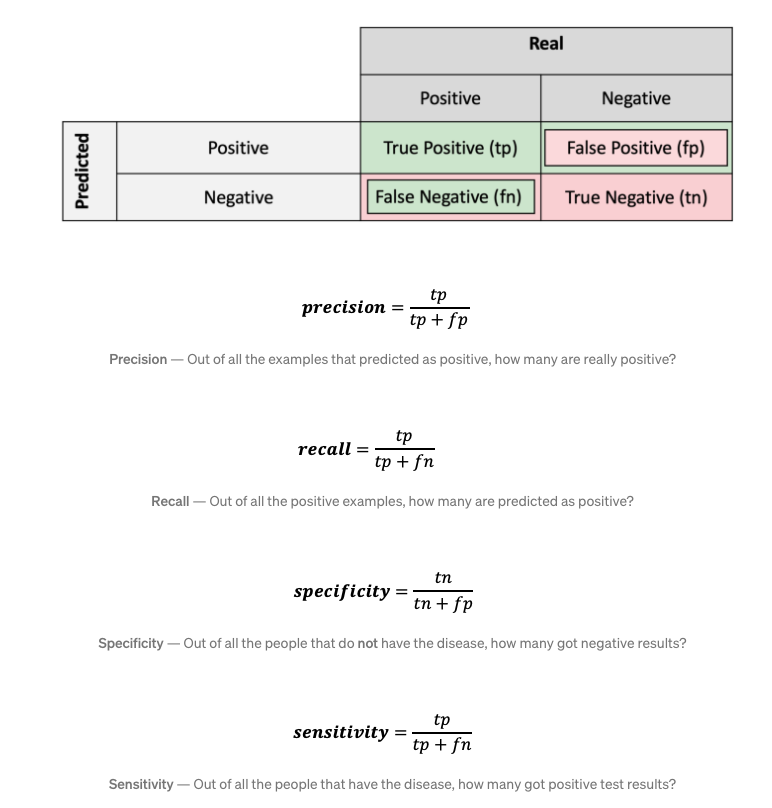

```{r setup, include=FALSE}
knitr::opts_chunk$set(echo = TRUE)
```

# Assessing the performance of machine learning models

In this document, different performance measures for prediction based on machine learning models are discussed. First, attention is given to some global performance measures. These measures are useful when comparing between different models or when tuning the parameters within a model, but they cannot be used for explaining why a model made a specific prediction. Therefore, we also look at local perfromance measures, such as Local Interpretable Model-Agnostic Explanations (LIME) and SHapley Additive exPlanations (SHAP). 

When explaining the different concepts, we will also show an application based on the Concrete Compressive Strength Data Set, which is experimental data from UCI (University of California machine learning repository) and discussed in Yeh (2018). 


```{r}
library(readxl)
library(DT)
dat = read_excel("Concrete_Data.xls",sheet=1)
datatable(dat)
names(dat) = c("Cement","BFS","Ash","Water","Plast","CA","FA","Age","CCS")
datatable(dat)
x_var = names(dat)[1:8]
```

The dataset consists of a continuous response, being the Concrete compressive strength, and 8 input features, which are all quantitative. The response looks as follows  

```{r}
boxplot(dat$CCS,horizontal=TRUE)
```

For example purposes, we also add a binary response variable, defined as 1 when CCS>35 and 0 otherwise, which leads to a balanced outcome:
```{r}
dat_Bin = dat
dat_Bin$Indicator = (dat$CCS>35)*1
dat_Bin$Indicator =as.factor(c("Low","High")[dat_Bin$Indicator+1])
table(dat_Bin$Indicator)
```

```{r,fig.width=16, fig.height=12}
library(caret)
featurePlot(x = dat_Bin[, 1:8], 
            y = as.factor(dat_Bin$Indicator), 
            plot = "pairs",
            ## Add a key at the top
            auto.key = list(columns = 3))
```


## Global Performance measures

When using machine learning methodology, the original dataset is split into two parts: a bigger part (e.g. 80% of the original data) for training the models (training set) and a smaller part (e.g. the remaining 20%) for assessing the model performance (test set). In addition, when the model parameters need to be tuned, techniques like cross-validation can be used to further split the training set to also obtain validation sets which can be used for parameter optimization. A 5-fold cross-validation approach is graphically depicted in the Figure below. In split 1, the model is trained on folds 2-4 and validated on fold 1 (which is the left-out fold in this case). The same procedure is repeated for splits 2-5 and an averaged performance metric can be calculated. The parameter value corresponding to the best averaged performance metric is selected as the optimal choice for the model under investigation.


When calculating the global performance measures, $N$ in the formulas below refers to either the number of observations in the test set or to the number of observations in the left-out fold, depending on whether the user wishes to compare between models or determine the optimal parameters within a model, respectively.

```{r}
dat_scaled <- data.frame(scale(dat))
dat_scaled$Indicator = dat_Bin$Indicator
set.seed(3456)
trainIndex <- createDataPartition(dat_scaled$Indicator, p = .8, 
                                  list = FALSE, 
                                  times = 1)

datTrain_scaled <- dat_scaled[ trainIndex,]
datTest_scaled  <- dat_scaled[-trainIndex,]

datTrain <- dat_Bin[ trainIndex,c(1:9)]
datTest  <- dat_Bin[-trainIndex,c(1:9)]

datTrain_bin <- dat_Bin[ trainIndex,c(1:8,10)]
datTest_bin  <- dat_Bin[-trainIndex,c(1:8,10)]

datatable(datTrain)
datatable(datTest)
```


### Continuous outcomes

For continuous outcomes, the three most common performance metrics are Mean Absolute Error (MAE), Mean Squared Error (MSE) and Root Mean Squared Error (RMSE). Below, these metrics are further detailed upon and are applied using a 1) linear regression model and 2) a gradient boosting machine fitted on the training dataset introduced above:
```{r}
mod_lin<- train(CCS ~ ., data = datTrain, 
                 method = "lm")
pred =  predict(mod_lin, datTest)
plot(pred,datTest$CCS)

mod_gbm =  train(CCS ~ ., data = datTrain, 
                 method = "xgbTree",verbosity=0)

pred_gbm =  predict(mod_gbm, datTest)

plot(pred,datTest$CCS)
points(pred_gbm,datTest$CCS,col="red")
abline(a=0,b=1,lwd=2,col="blue")

mod_log = train(Indicator ~ ., data = datTrain_bin, 
                 method = "glm",
                  family = "binomial")
pred_bin =  predict(mod_log, datTest_bin)

ctrl <- trainControl(method = "cv",number=5)
set.seed(1)
mod_gbm_bin <- train(Indicator ~ ., data = datTrain_bin,
                 method = "xgbTree",
                 verbose = FALSE,                    
                 trControl = ctrl,verbosity=0)

pred_gbm_bin <- predict(mod_gbm_bin, newdata=datTest_bin)

```

From the graph above, it is observed that the results of the linear model (shown in black) seem to be less in line with the true observations as compared to the predictions based on the GBM. In addition, it should however be noted that no parameter tuning for the GBM is performed and hence this model could still be improved. For example purposes, this latter step was not included. Based on the global performance measures below, a more formal comparison between the models will be made. 


#### Mean Absolute Error (MAE),

The Mean Absolute Error is the average of the difference between the ground truth and the predicted values. Mathematically, its represented as :
$$
MAE = \frac{1}{N} \sum_{i=1}^N{\left|y_i - \hat{y_i}\right|} 
$$

where

* $y_i$ is the true value,
* $y_i$ is the predicted value from the machine learnig model,
* $N$ is the number of observations that have been predicted.

Applied to the CCS data, we obtain:
```{r}
MAE = mean(abs(datTest$CCS - pred))
print(MAE)

MAE_gbm = mean(abs(datTest$CCS - pred_gbm))
print(MAE_gbm)
```
which means that our linear regression model makes an average absolute error of `r round(MAE,4)`MPa as compared to an average absolute error of `r round(MAE_gbm,4)`MPa for the GBM model. 


#### Mean Squared Error (MSE) and Root Mean Squared Error (RMSE).

The mean squared error is perhaps the most popular metric used for regression problems. It essentially finds the average of the squared difference between the target value and the value predicted by the regression model:
$$
MSE = \frac{1}{N} \sum_{i=1}^N{(y_i - \hat{y_i})^2} 
$$
It should be noted that the error interpretation has to be done with squaring factor in mind. This is remedied by looking at the square root of the MSE, denoted by the root mean squared error, abbreviated by RMSE:
$$
RMSE = \sqrt{\frac{1}{N} \sum_{i=1}^N{(y_i - \hat{y_i})^2} }
$$

Applied to the CCS data, we obtain:
```{r}
MSE = mean((datTest$CCS - pred)^2)
print(MSE)
RMSE = sqrt(MSE)
print(RMSE)

MSE_gbm = mean((datTest$CCS - pred_gbm)^2)
print(MSE_gbm)
RMSE_gbm = sqrt(MSE_gbm)
print(RMSE_gbm)
```
which means that our linear regression model makes an average squared error of `r round(MSE,4)`MPa squared as compared to an average squared error of `r round(MSE_gbm,4)`MPa squared for the GBM predictions. Or equivalently, the average error is `r round(RMSE,4)` MPa for the linear model and `r round(RMSE_gbm,4)`MPa for the GBM. One can conclude that the GBM is most appropriate when the aim is to predict new observations.


### Binary outcomes

For binary (or more general categorical) outcomes, one often makes a confusion matrix, from where different metrics can be derived. Some of them include:

* Recall, Sensitivity
* Specificity
* Precision

which are explained on the Figure below.



In addition, we also have 

* Accuracy = $\frac{TP+TN}{TP+TN+FP+FN}$
* Cohen's Kappa tells us how much better our classifier is performing over the performance of a classifier that simply guesses at random according to the frequency of each class ($\kappa = \frac{p_o-p_e}{1-p_e}$, with $p_o$ the observed agreement, i.e. accuracy, and $p_e$ the expected agreement). Landis and Koch (1977) provide a way to characterize values: a value < 0 is indicating no agreement , 0–0.20 as slight, 0.21–0.40 as fair, 0.41–0.60 as moderate, 0.61–0.80 as substantial, and 0.81–1 as almost perfect agreement.  
* F1-score = $2\frac{Precision * Recall}{Precision + Recall}$
* AUC is the area under the ROC curve, where the ROC curve plot the true positive rate (TPR, i.e. recall) versus the true negative rate (TNR, i.e. 1-specificity). The area is located between 0 and 1, where a value of 0.5 corresponds to a random classification.  

An application is found below, where the performance of the logistic regression model on the GBM model fitted on the CCS data with the binary indicator outcome is compared.

```{r}
confusionMatrix(pred_bin,datTest_bin$Indicator, mode = "everything")
confusionMatrix(pred_gbm_bin,datTest_bin$Indicator, mode = "everything")
```

## PIP: The Probability of Improved  Prediction

The PIP can be used for both binary and continuous outcomes as it quantifies how often one model outperforms the other when predicting new individual observations. Below, the repCV5 PIP is considered:

### Continuous outcome

* PIP based on the test set
```{r}
PIP = mean((datTest$CCS - pred_gbm)^2 < (datTest$CCS - pred)^2)
print(PIP)
```


* PIP when model training

```{r, cache=TRUE}
set.seed(1988)
reps=5
K=5
PIP_cv=c()
for(l in 1:reps){
  dat=datTrain
  yourData<-dat[sample(nrow(dat)),]
  cvIndex <- createFolds(dat$CCS, K, returnTrain = T)
  
  #Perform K fold cross validation
  
  pip_cv = c()

    for(j in names(cvIndex)){
    
    trainData = yourData[cvIndex[[j]],]
    testData = yourData[-cvIndex[[j]],]
    
    x_train <- trainData[, 1:8]
    y_train <- trainData[, 9]
    
    x_test <- testData[, 1:8]
    y_test <- testData[, 9]
    
    #pars = mod_gbm$bestTune

    # gbmGrid <-  expand.grid(interaction.depth = pars$interaction.depth, 
    #                     n.trees = pars$n.trees, 
    #                     shrinkage = pars$shrinkage,
    #                     n.minobsinnode = pars$n.minobsinnode) 
    
    mod1=  train(CCS ~ ., data = trainData, 
                 method = "xgbTree",verbosity=0)
    
    mod0<- train(CCS ~ ., data = trainData, 
                 method = "lm")

    pred0 =  predict(mod0, testData)
    pred1 =  predict(mod1, testData)

  pip_cv = c(pip_cv,mean((pred1-y_test)^2 < (pred0-y_test)^2) + 0.5*mean((pred1-y_test)^2 == (pred0-y_test)^2) )
 
}
PIP_cv = c(PIP_cv,mean(pip_cv))
}
print(mean(PIP_cv))
```

### Binary outcome

* PIP based on the test set
```{r}
PIP = mean(((datTest_bin$Indicator=="Low")*1 - (pred_gbm_bin=="Low")*1)^2 < ((datTest_bin$Indicator=="Low")*1 - (pred_bin=="Low")*1)^2)+0.5*mean(((datTest_bin$Indicator=="Low")*1 - (pred_gbm_bin=="Low")*1)^2 == ((datTest_bin$Indicator=="Low")*1 - (pred_bin=="Low")*1)^2)
print(PIP)
```


* PIP when model training

```{r, cache=TRUE}
set.seed(1988)
reps=5
K=5
PIP_cv=c()
for(l in 1:reps){
  dat=datTrain_bin
  yourData<-dat[sample(nrow(dat)),]
  cvIndex <- createFolds(dat$Indicator, K, returnTrain = T)
  
  #Perform K fold cross validation
  
  pip_cv = c()

    for(j in names(cvIndex)){
    
    trainData = yourData[cvIndex[[j]],]
    testData = yourData[-cvIndex[[j]],]
    
    x_train <- trainData[, 1:8]
    y_train <- trainData[, 9]
    
    x_test <- testData[, 1:8]
    y_test <- testData[, 9]=="Low"
    
    #pars = mod_gbm$bestTune

    # gbmGrid <-  expand.grid(interaction.depth = pars$interaction.depth, 
    #                     n.trees = pars$n.trees, 
    #                     shrinkage = pars$shrinkage,
    #                     n.minobsinnode = pars$n.minobsinnode) 
    
    mod0 = train(Indicator ~ ., data = trainData, 
                 method = "glm",
                  family = "binomial")
    pred0 =  predict(mod0, testData)=="Low"

    ctrl <- trainControl(method = "cv",number=5)
    set.seed(1)
    mod1 <- train(Indicator ~ ., data = trainData,
                 method = "xgbTree",verbosity=0,                    
                 trControl = ctrl)

    pred1 <- predict(mod1, newdata=testData)=="Low"

  pip_cv = c(pip_cv,mean((pred1-y_test)^2 < (pred0-y_test)^2) + 0.5*mean((pred1-y_test)^2 == (pred0-y_test)^2) )
 
}
PIP_cv = c(PIP_cv,mean(pip_cv))
}
print(mean(PIP_cv))
```


* PIP when considering the raw predicted probabilities for the test set

```{r}
pred_gbm_bin_raw <- predict(mod_gbm_bin, newdata=datTest_bin,type="prob")[,2]
pred_log_bin_raw <- predict(mod_log, newdata=datTest_bin,type="prob")[,2]

PIP_raw = mean(((datTest_bin$Indicator=="Low")*1 - pred_gbm_bin_raw)^2 < ((datTest_bin$Indicator=="Low")*1 - pred_log_bin_raw)^2)+0.5*mean(((datTest_bin$Indicator=="Low")*1 - pred_gbm_bin_raw)^2 == ((datTest_bin$Indicator=="Low")*1 - pred_log_bin_raw)^2)
print(PIP_raw)
```

From here, we see that while the binary predictions based on logistic regression and GBM are pretty close (PIP = `r round(PIP,4)`), the underlying raw probabilities are targeted more towards the extremes for GBM (PIP = `r round(PIP_raw,4)`)  

## Local Performance measures

Above, it was seen that the GBM often outperforms standard linear or logistic regression models when it comes down to predictive accuracy. One of the mentioned disadvantages for the GBM is that it is less interpretable, in the sense that one cannot tell directly how specific covariates influence the prediction. Nevertheless, this disadvantage is is easily addressed with various tools such as variable importance, partial dependence plots, LIME, SHAP,...).

Below, we only focus on the GBM model for the continuous outcome variable.


### Variable importance

```{r}
library(gbm)
gbm_imp = varImp(mod_gbm)
plot(gbm_imp)
```

### Partial dependence 

In the plots below, we show the partial dependence of the output on each of the individual input variables. The y-axis mentions yhat, but is rather the average output based on the mean of all other input features. For example, age seems to have a positive effect on CCS upto 100 days, after which there is no longer an effect.


```{r}
library(pdp)
library(ggplot2)

for(x in x_var){
par1 <- partial(mod_gbm, pred.var = x, chull = TRUE)
plot1 <- autoplot(par1, contour = TRUE)
print(plot1)
}


# Two Variables
par2 <- partial(mod_gbm, pred.var = x_var[1:2], chull = TRUE)
plot2 <- autoplot(par2, contour = TRUE, 
               legend.title = "Partial\ndependence")
print(plot2)
```

### LIME

```{r, fig.height=16,fig.width=12}
library(lime)
explainer <- lime(datTrain,mod_gbm, bin_continuous = TRUE, quantile_bins = FALSE)
explanation <- explain(datTest[1:4,], explainer,n_features = 8)
explanation[, 2:9]
plot_features(explanation, ncol = 1)
```

### SHAP
GBM is not natively supported at the moment. We refit using xgboost


```{r, fig.height=16,fig.width=12}
library(shapr)

explainer <- shapr(datTrain, mod_gbm$finalModel)

# Specifying the phi_0, i.e. the expected prediction without any features
p <- mean(datTrain$CCS)

# Computing the actual Shapley values with kernelSHAP accounting for feature dependence using
# the empirical (conditional) distribution approach with bandwidth parameter sigma = 0.1 (default)
explanation <- explain(
  datTest,
  approach = "empirical",
  explainer = explainer,
  prediction_zero = p
)

# Printing the Shapley values for the test data.
# For more information about the interpretation of the values in the table, see ?shapr::explain.
print(explanation$dt)
#>      none     lstat         rm       dis      indus
#> 1: 22.446 5.2632030 -1.2526613 0.2920444  4.5528644
#> 2: 22.446 0.1671903 -0.7088405 0.9689007  0.3786871
#> 3: 22.446 5.9888016  5.5450861 0.5660136 -1.4304350
#> 4: 22.446 8.2142203  0.7507569 0.1893368  1.8298305
#> 5: 22.446 0.5059890  5.6875106 0.8432240  2.2471152
#> 6: 22.446 1.9929674 -3.6001959 0.8601984  3.1510530

# Plot the resulting explanations for observations 1 and 6
plot(explanation, plot_phi0 = FALSE, index_x_test = c(1:4))

```


## Relation SHAP PIP?

Idea: the SHAP value indicates the individual contribution of each predictor to the total prediction. If the predictors are standardized, then a large contribution points towards a more important variable. Therefore, the mean of the absolute SHAP values should telle something about the importance of a specific predictor. In parallel, a PIP can be calculated for the full model vs. the model without that specific predictor. Is there a relationship between the mean shap valua and the PIP?

Simulation study:

```{r, cache=TRUE}
library(xgboost)
library(SHAPforxgboost)

data("Boston", package = "MASS")
Boston = data.frame(scale(Boston))
x_var <- c("lstat", "rm", "dis", "indus")
y_var <- "medv"

PIP = function(drop,reps,seed=1988,dat=Boston){
PIP_cv = c()
MSE0 = c()
MSE1 = c()
shap = rep(NA,4)
set.seed(seed)
for(l in 1:reps){
  yourData<-dat[sample(nrow(dat)),]
  cvIndex <- createFolds(dat$medv, 5, returnTrain = T)
  
  #Perform K fold cross validation
  
  pip_cv = c()
  mse0 = c()
  mse1 = c()
  mean_shap = rep(NA,4)
    for(j in names(cvIndex)){
    
    trainData = yourData[cvIndex[[j]],]
    testData = yourData[-cvIndex[[j]],]
    
    x_train <- as.matrix(trainData[, x_var])
    y_train <- trainData[, y_var]
    
    x_test <- as.matrix(testData[, x_var])
    y_test <- testData[, y_var]
    
    mod0 <-xgboost(
      data = x_train[,x_var[-drop]],
      label = y_train,
      nround = 100,
      verbose = FALSE
    ) 
      
    mod1<- xgboost(
        data = x_train,
        label = y_train,
        nround = 100,
        verbose = FALSE
      )
    
    pred0 = predict(mod0,x_test[,x_var[-drop]])
    pred1 = predict(mod1,x_test)

  pip_cv = c(pip_cv,mean((pred1-y_test)^2 < (pred0-y_test)^2) + 0.5*mean((pred1-y_test)^2 == (pred0-y_test)^2) )
  mse0 = c(mse0,mean((pred0-y_test)^2))
  mse1 = c(mse1,mean((pred1-y_test)^2))
  
  shap_values <- shap.values(xgb_model = mod1, X_train =x_test)
  mean_shap = rbind(mean_shap,shap_values$mean_shap_score)
}
PIP_cv = c(PIP_cv,mean(pip_cv))
MSE0 = c(MSE0,mean(mse0))
MSE1 = c(MSE1,mean(mse1))
shap = rbind(shap,apply(mean_shap,2,mean,na.rm=TRUE))
}
return(list("PIP_cv"=mean(PIP_cv),"MSE0_cv"=mean(MSE0),"MSE1_cv"=mean(MSE1),"SHAP" = apply(shap,2,mean,na.rm=TRUE)))
}


# Simulation based on linaer model fitted on the full scaled Boston data
lin_mod_full = lm(medv~lstat+rm+dis+indus,data=Boston)


res <- vector(mode = "list", length = length(x_var))
names(res) = x_var
sampsize= 500

for(sims in 1:1000){
  set.seed(sims)
  x1 = rnorm(sampsize,0,1)
  x2 = rnorm(sampsize,0,1)
  x3 = rnorm(sampsize,0,1)
  x4 = rnorm(sampsize,0,1)
  x = cbind(rep(1,sampsize),x1,x2,x3,x4)
  y = t(coef(lin_mod_full)%*%t(x)) + rnorm(sampsize,0,sigma(lin_mod_full))
  
  dat_use = data.frame(cbind(y,x[,2:5]))
  names(dat_use) = c(y_var,x_var)
  
  for(j in 1:length(x_var)){
    results = PIP(j,reps=10,seed=1988,dat=dat_use)
    res[[x_var[j]]]$PIP = c(res[[x_var[j]]]$PIP,results$PIP_cv)
    res[[x_var[j]]]$MSE_diff = c(res[[x_var[j]]]$MSE_diff,results$MSE0_cv - results$MSE1_cv)
    res[[x_var[j]]]$SHAP = c(res[[x_var[j]]]$SHAP,results$SHAP[x_var[j]])
  }
}


for(i in 1:4){
dat_sum = data.frame(cbind(PIP=res[[i]]$PIP,MSE=res[[i]]$MSE_diff,SHAP=res[[i]]$SHAP))
p = ggplot(dat=dat_sum,aes(x = MSE,y=PIP,col=SHAP))+geom_point()+
  ggtitle(paste0("Pearson correlation: ",round(cor(res[[i]]$PIP,res[[i]]$MSE),2)))
print(p)
}

for(i in 1:4){
  dat_sum = data.frame(cbind(PIP=res[[i]]$PIP,MSE=res[[i]]$MSE_diff,SHAP=res[[i]]$SHAP))
  p = ggplot(dat=dat_sum,aes(x = PIP,y=SHAP,col=MSE))+geom_point()+
    ggtitle(paste0("Pearson correlation: ",round(cor(res[[i]]$PIP,res[[i]]$SHAP),2)))
  print(p)
}
```

```{r}
for(i in 1:4){
  dat_sum = data.frame(cbind(PIP=res[[i]]$PIP,MSE=res[[i]]$MSE_diff,SHAP=res[[i]]$SHAP))
  p = ggplot(dat=dat_sum,aes(x = MSE,y=SHAP,col=PIP))+geom_point()+
    ggtitle(paste0("Pearson correlation: ",round(cor(res[[i]]$MSE,res[[i]]$SHAP),2)))
  print(p)
}
```


# References
I-Cheng Yeh, "Modeling of strength of high performance concrete using artificial neural networks," Cement and Concrete Research, Vol. 28, No. 12, pp. 1797-1808 (1998).

http://uc-r.github.io/gbm_regression
https://cran.r-project.org/web/packages/lime/vignettes/Understanding_lime.html


